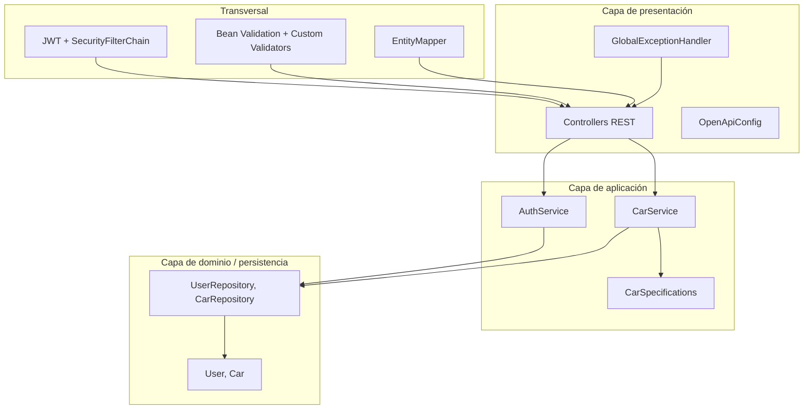
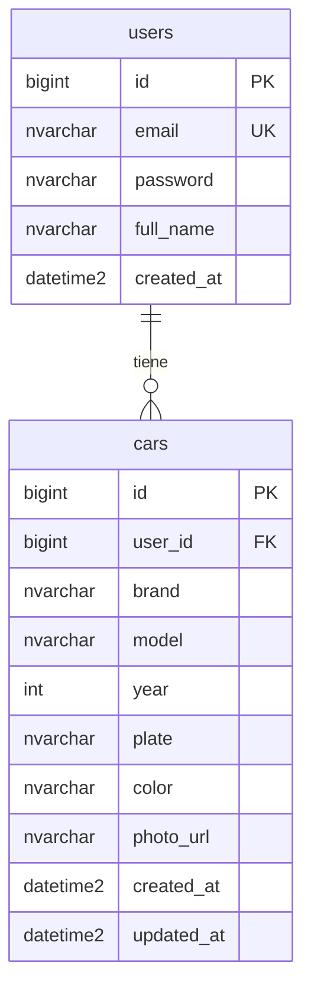
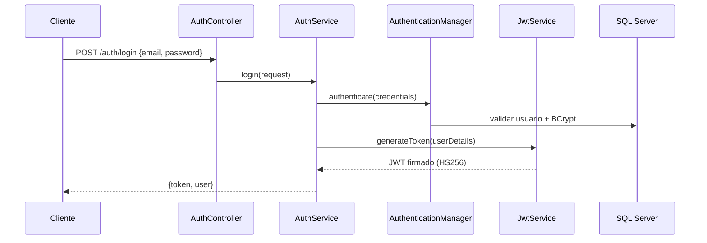
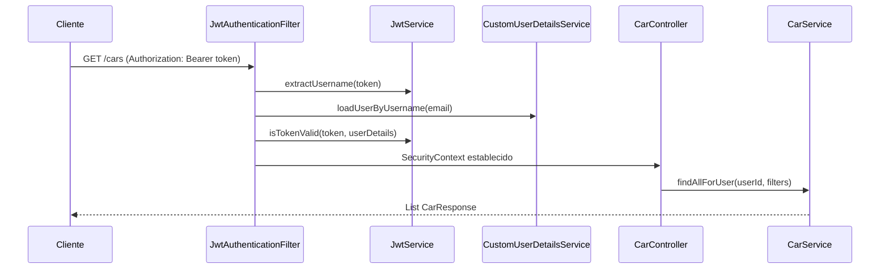

# Informe técnico — Backend

Documentación de arquitectura, tecnologías y convenciones del API REST del sistema **Registro y Gestión de Autos**.

---

## 1. Resumen ejecutivo

El backend es una API REST stateless construida con **Spring Boot 3** y **Java 17**. Expone endpoints de autenticación (JWT) y CRUD de autos, con persistencia en **SQL Server** mediante JPA/Hibernate. Sigue una **arquitectura en capas** (Controller → Service → Repository → Entity) con DTOs, validación declarativa, manejo centralizado de excepciones y documentación OpenAPI/Swagger.

| Aspecto | Detalle |
|---------|---------|
| Artefacto | `com.registroautos:registro-autos-backend:1.0.0` |
| Puerto por defecto | `8080` |
| Prefijo API | `/api/v1` |
| Autenticación | JWT Bearer (stateless) |
| Base de datos | SQL Server (Azure SQL Database en producción) |

### Acceso en produccion

| Servicio | URL |
|----------|-----|
| API (backend) | https://solucion-registro-autos.onrender.com |
| Swagger | https://solucion-registro-autos.onrender.com/swagger-ui.html |
| Health check | https://solucion-registro-autos.onrender.com/health |
| Portal (frontend) | https://registrovehiculos.ingandressanchez.com |

**Credenciales demo:** `demo@registroautos.com` / `Demo123!`

> El backend en Render (plan gratuito) puede tardar ~1 min en responder si estuvo inactivo.

---

## 2. Stack tecnológico

| Tecnología | Versión | Uso |
|------------|---------|-----|
| Java | 17 | Lenguaje y runtime |
| Spring Boot | 3.4.5 | Framework principal |
| Spring Web | — | REST controllers, servlet embebido |
| Spring Data JPA | — | ORM, repositorios, specifications |
| Spring Security | — | Autenticación, autorización, BCrypt |
| Spring Validation | — | Bean Validation (Jakarta) |
| Microsoft SQL Server JDBC | runtime | Driver de base de datos |
| JJWT | 0.12.6 | Generación y validación de tokens JWT |
| Springdoc OpenAPI | 2.8.6 | Swagger UI y documentación de API |
| Maven | 3.9 | Build y gestión de dependencias |

### Variables de entorno relevantes

| Variable | Descripción | Default |
|----------|-------------|---------|
| `SPRING_DATASOURCE_URL` | JDBC URL de SQL Server | `localhost:1433` |
| `SPRING_DATASOURCE_USERNAME` | Usuario BD | `sa` |
| `SPRING_DATASOURCE_PASSWORD` | Contraseña BD | — |
| `JWT_SECRET` | Clave HMAC (mín. 32 bytes) | valor en `application.yml` |
| `JWT_EXPIRATION_MS` | Expiración del token en ms | `86400000` (24 h) |

Configuración principal: [`backend/src/main/resources/application.yml`](../backend/src/main/resources/application.yml)

---

## 3. Metodologías y principios de diseño

### 3.1 Arquitectura en capas (Layered Architecture)

Cada capa tiene una responsabilidad única (SRP):



| Capa | Paquete | Responsabilidad |
|------|---------|-----------------|
| Presentación | `controller` | Recibir HTTP, validar entrada (`@Valid`), devolver DTOs |
| Aplicación | `service` | Reglas de negocio, transacciones, orquestación |
| Dominio | `entity` | Modelo de datos persistido |
| Infraestructura | `repository` | Acceso a datos (Spring Data JPA) |
| Transversal | `config`, `security`, `exception`, `validation`, `mapper` | Seguridad, errores, validación, mapeo |

### 3.2 Principios SOLID aplicados

| Principio | Aplicación en el proyecto |
|-----------|---------------------------|
| **S** — Single Responsibility | Cada clase tiene un rol: `JwtService` solo maneja tokens; `CarService` solo lógica de autos |
| **O** — Open/Closed | Validadores custom (`@ValidPlate`, `@ValidYear`) extienden Bean Validation sin modificar DTOs |
| **L** — Liskov Substitution | `JwtAuthenticationFilter` extiende `OncePerRequestFilter` correctamente |
| **I** — Interface Segregation | Repositorios exponen solo métodos necesarios (`findByIdAndUserId`, etc.) |
| **D** — Dependency Inversion | Servicios dependen de interfaces `JpaRepository`, no de implementaciones concretas |

### 3.3 Patrones de diseño

| Patrón | Implementación |
|--------|----------------|
| **DTO** | Records inmutables (`CarRequest`, `CarResponse`) separan contrato API de entidades JPA |
| **Repository** | `UserRepository`, `CarRepository` abstraen acceso a datos |
| **Specification** | `CarSpecifications.forUserWithFilters()` para consultas dinámicas con Criteria API |
| **Filter Chain** | `JwtAuthenticationFilter` intercepta requests antes del filtro de autenticación estándar |
| **Mapper estático** | `EntityMapper` convierte Entity → DTO (clase `final`, constructor privado) |
| **Controller Advice** | `GlobalExceptionHandler` centraliza respuestas de error en JSON uniforme |
| **Schema-first DB** | `ddl-auto: validate` — el esquema lo define SQL externo, Hibernate solo valida |

### 3.4 Convenciones de código

- **Inyección por constructor** en todos los beans (sin `@Autowired` en campos)
- **Transacciones declarativas**: `@Transactional` en servicios; `readOnly = true` en consultas
- **Records Java** para DTOs inmutables
- **Normalización de datos**: email → lowercase; placa → uppercase; trim en strings
- **Ownership por usuario**: todo acceso a autos filtra por `userId` del token JWT

---

## 4. Estructura del proyecto

```
backend/
├── pom.xml                          # Dependencias Maven
├── Dockerfile                       # Build multi-stage
├── .dockerignore
└── src/
    ├── main/
    │   ├── java/com/registroautos/
    │   │   ├── RegistroAutosApplication.java
    │   │   ├── config/
    │   │   │   ├── SecurityConfig.java      # Filter chain, CORS, BCrypt
    │   │   │   └── OpenApiConfig.java       # Swagger + esquema Bearer JWT
    │   │   ├── controller/
    │   │   │   ├── AuthController.java      # /api/v1/auth
    │   │   │   └── CarController.java       # /api/v1/cars
    │   │   ├── service/
    │   │   │   ├── AuthService.java
    │   │   │   ├── CarService.java
    │   │   │   └── CarSpecifications.java
    │   │   ├── repository/
    │   │   │   ├── UserRepository.java
    │   │   │   └── CarRepository.java
    │   │   ├── entity/
    │   │   │   ├── User.java
    │   │   │   └── Car.java
    │   │   ├── dto/                         # 7 records (request/response/error)
    │   │   ├── security/
    │   │   │   ├── JwtService.java
    │   │   │   ├── JwtAuthenticationFilter.java
    │   │   │   └── CustomUserDetailsService.java
    │   │   ├── validation/
    │   │   │   ├── ValidPlate.java + ValidPlateValidator.java
    │   │   │   └── ValidYear.java + ValidYearValidator.java
    │   │   ├── exception/
    │   │   │   ├── GlobalExceptionHandler.java
    │   │   │   └── *Exception.java (3 tipos de dominio)
    │   │   └── mapper/
    │   │       └── EntityMapper.java
    │   └── resources/
    │       └── application.yml
    └── test/
        └── java/com/registroautos/
            └── RegistroAutosApplicationTests.java
```

---

## 5. Modelo de datos

### 5.1 Relación entre entidades



- Relación **uno-a-muchos**: un `User` puede tener muchos `Car`
- Constraint única: `(user_id, plate)` — un usuario no puede repetir placa
- `ON DELETE CASCADE`: al eliminar usuario, se eliminan sus autos
- Schema SQL: [`seed/init/01-schema.sql`](../seed/init/01-schema.sql)

### 5.2 Entidad `User`

| Campo | Tipo | Notas |
|-------|------|-------|
| `id` | `Long` | `IDENTITY` auto-increment |
| `email` | `String` | Único, usado como username en JWT |
| `password` | `String` | Hash BCrypt, nunca expuesto en API |
| `fullName` | `String` | Nombre completo del usuario |
| `createdAt` | `LocalDateTime` | `@CreationTimestamp` |

### 5.3 Entidad `Car`

| Campo | Tipo | Notas |
|-------|------|-------|
| `id` | `Long` | `IDENTITY` auto-increment |
| `user` | `User` | `@ManyToOne` LAZY |
| `brand`, `model` | `String` | Marca y modelo |
| `year` | `Integer` | Año de fabricación |
| `plate` | `String` | Placa (3 letras + 3 dígitos) |
| `color` | `String` | Color del vehículo |
| `photoUrl` | `String` | URL simulada de foto (nullable) |
| `createdAt`, `updatedAt` | `LocalDateTime` | Auditoría automática |

---

## 6. Seguridad y autenticación JWT

### 6.1 Flujo de autenticación



### 6.2 Flujo de petición autenticada



### 6.3 Rutas y permisos

| Ruta | Acceso |
|------|--------|
| `/api/v1/auth/**` | Público |
| `/swagger-ui/**`, `/v3/api-docs/**` | Público |
| `/api/v1/cars/**` | Requiere JWT válido |
| Todo lo demás | Requiere JWT válido |

- **Stateless**: `SessionCreationPolicy.STATELESS`, sin cookies de sesión
- **CSRF**: deshabilitado (API REST con JWT)
- **CORS**: habilitado para desarrollo (`allowedOriginPatterns: *`)
- **Password encoding**: BCrypt via `BCryptPasswordEncoder`
- **Rol único**: todos los usuarios reciben `ROLE_USER`

---

## 7. API REST

### 7.1 Autenticación — `/api/v1/auth`

| Método | Ruta | Body | Response | Status |
|--------|------|------|----------|--------|
| `POST` | `/register` | `{ fullName, email, password }` | `UserResponse` | 201 |
| `POST` | `/login` | `{ email, password }` | `{ token, user }` | 200 |

### 7.2 Autos — `/api/v1/cars` (requiere JWT)

| Método | Ruta | Body / Query | Response | Status |
|--------|------|--------------|----------|--------|
| `GET` | `/` | `?search=&brand=&year=` | `CarResponse[]` | 200 |
| `GET` | `/{id}` | — | `CarResponse` | 200 |
| `POST` | `/` | `CarRequest` | `CarResponse` | 201 |
| `PUT` | `/{id}` | `CarRequest` | `CarResponse` | 200 |
| `DELETE` | `/{id}` | — | vacío | 204 |

### 7.3 Filtros de búsqueda (GET `/cars`)

| Parámetro | Comportamiento |
|-----------|----------------|
| `search` | LIKE case-insensitive en `plate` y `model` |
| `brand` | Match exacto case-insensitive |
| `year` | Match exacto numérico |

### 7.4 Contratos DTO

**Entrada — `CarRequest`:**
```json
{
  "brand": "Toyota",
  "model": "Corolla",
  "year": 2023,
  "plate": "MWK737",
  "color": "Gris",
  "photoUrl": "https://example.com/foto.jpg"
}
```

**Salida — `CarResponse`:**
```json
{
  "id": 1,
  "brand": "Toyota",
  "model": "Corolla",
  "year": 2023,
  "plate": "MWK737",
  "color": "Gris",
  "photoUrl": "https://example.com/foto.jpg",
  "createdAt": "2026-06-04T12:00:00",
  "updatedAt": "2026-06-04T12:00:00"
}
```

**Error — `ErrorResponse`:**
```json
{
  "timestamp": "2026-06-04T12:00:00",
  "status": 400,
  "error": "Bad Request",
  "message": "La placa debe tener el siguiente formato 3 Letra + 3 Numeros (ej. MWK737)",
  "path": "/api/v1/cars",
  "fieldErrors": {
    "plate": "La placa debe tener el siguiente formato 3 Letra + 3 Numeros (ej. MWK737)"
  }
}
```

---

## 8. Validaciones

### 8.1 Validación de entrada (Bean Validation)

| DTO / Campo | Reglas |
|-------------|--------|
| `RegisterRequest.email` | `@Email`, `@NotBlank` |
| `RegisterRequest.password` | Mín. 8 chars, 1 mayúscula, 1 dígito |
| `CarRequest.plate` | `@ValidPlate` → `^[A-Z]{3}\d{3}$` |
| `CarRequest.year` | `@ValidYear` → 1900 hasta año actual |
| `CarRequest.brand/model` | `@NotBlank`, `@Size(max=100)` |

### 8.2 Validación de negocio (en servicios)

| Regla | Excepción | HTTP |
|-------|-----------|------|
| Email duplicado al registrar | `DuplicateResourceException` | 409 |
| Placa duplicada por usuario | `DuplicateResourceException` | 409 |
| Auto no encontrado o no pertenece al usuario | `ResourceNotFoundException` | 404 |
| Credenciales inválidas | `BadCredentialsException` | 401 |

---

## 9. Manejo de excepciones

`GlobalExceptionHandler` (`@RestControllerAdvice`) unifica todas las respuestas de error:

| Excepción | HTTP | Mensaje típico |
|-----------|------|----------------|
| `ResourceNotFoundException` | 404 | "Auto no encontrado" |
| `DuplicateResourceException` | 409 | "El email ya esta registrado" |
| `UnauthorizedAccessException` | 403 | Mensaje de la excepción |
| `BadCredentialsException` | 401 | "Credenciales invalidas" |
| `MethodArgumentNotValidException` | 400 | Primer error + mapa `fieldErrors` |
| `Exception` (genérica) | 500 | "Error interno del servidor" |

---

## 10. Documentación OpenAPI / Swagger

- **Swagger UI (local):** `http://localhost:8080/swagger-ui.html`
- **Swagger UI (producción):** https://solucion-registro-autos.onrender.com/swagger-ui.html
- **API Docs JSON (local):** `http://localhost:8080/v3/api-docs`
- **API Docs JSON (producción):** https://solucion-registro-autos.onrender.com/v3/api-docs
- Esquema de seguridad: `bearerAuth` (HTTP Bearer JWT)
- Anotaciones: `@Tag`, `@Operation`, `@SecurityRequirement`

**Uso con JWT en Swagger:**
1. Ejecutar `POST /api/v1/auth/login`
2. Copiar el `token` de la respuesta
3. Clic en **Authorize** → ingresar `Bearer <token>`

---

## 11. Build, ejecución y Docker

### 11.1 Desarrollo local

```bash
cd backend
mvn spring-boot:run
```

Requiere SQL Server accesible (ver `application.yml` o variables de entorno).

### 11.2 Build

```bash
mvn package -DskipTests
# Genera: target/registro-autos-backend-1.0.0.jar
```

### 11.3 Docker (multi-stage)

| Stage | Imagen | Acción |
|-------|--------|--------|
| Build | `maven:3.9-eclipse-temurin-17` | `mvn package -DskipTests` |
| Runtime | `eclipse-temurin:17-jre` | `java -jar app.jar` (usuario no-root) |

El servicio `backend` en `docker-compose.yml` depende de `db-init` y recibe variables de conexión y JWT desde `.env`.

---

## 12. Testing

Documentación completa: **[Tests unitarios — Backend](backend-testing.md)**

### Ejecutar tests

```bash
cd backend
mvn test
```

**44 tests** — no requieren SQL Server (perfil `test` con H2 en memoria).

### Cobertura actual

| Módulo | Tests |
|--------|-------|
| `AuthService` | Registro, login, email duplicado |
| `CarService` | CRUD, ownership, placa duplicada |
| `JwtService` | Token, validación, secreto |
| `ValidPlateValidator` / `ValidYearValidator` | Reglas de negocio |
| `EntityMapper` | Mapeo Entity → DTO |
| `GlobalExceptionHandler` | Códigos HTTP de error |
| `RegistroAutosApplicationTests` | Smoke test del contexto Spring |

### Pendiente recomendado

- Tests de controladores con `@WebMvcTest` + `MockMvc`
- Tests de seguridad end-to-end
- Testcontainers con SQL Server real
- JaCoCo para cobertura en CI

---

## 13. Guía rápida para nuevos desarrolladores

### Agregar un nuevo endpoint

1. Crear/actualizar DTO en `dto/`
2. Agregar lógica en `service/`
3. Exponer en `controller/` con `@Valid` y anotaciones OpenAPI
4. Si requiere auth, el JWT filter ya protege rutas bajo `/api/v1/`

### Agregar una validación custom

1. Crear anotación en `validation/` (ej. `@ValidX`)
2. Implementar `ConstraintValidator` correspondiente
3. Aplicar en el DTO con la anotación

### Agregar una entidad

1. Crear entidad JPA en `entity/`
2. Agregar script SQL en `seed/init/`
3. Crear `JpaRepository` en `repository/`
4. Mantener `ddl-auto: validate` — Hibernate no crea tablas

### Checklist antes de un PR

- [ ] DTOs no exponen entidades JPA directamente
- [ ] Servicios con `@Transactional` donde corresponda
- [ ] Validación en DTO + reglas de negocio en servicio
- [ ] Errores tipados (no genéricos) con mensajes claros en español
- [ ] Endpoint documentado en Swagger
- [ ] Recursos de usuario filtrados por `userId` del token
