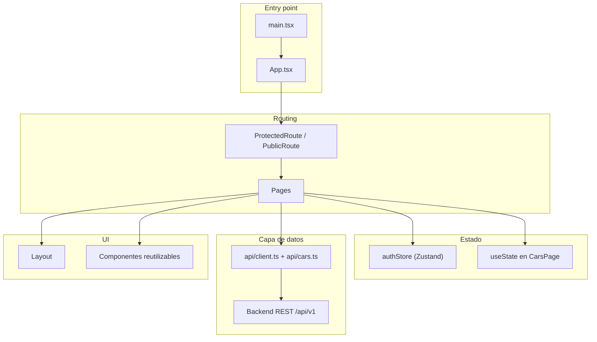
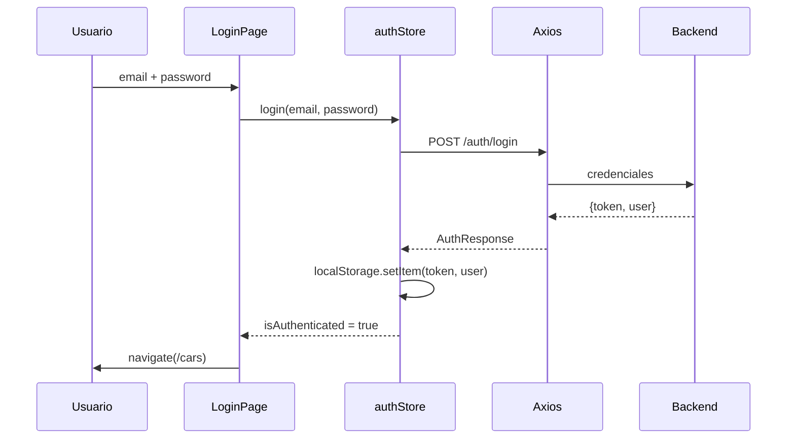
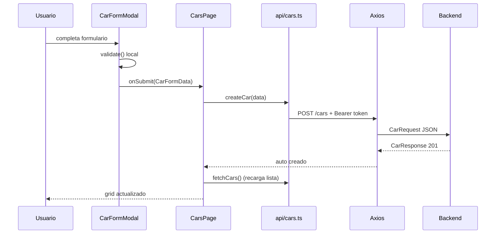

# Informe técnico — Frontend

Documentación de arquitectura, tecnologías y convenciones de la SPA del sistema **Registro y Gestión de Autos**.

---

## 1. Resumen ejecutivo

El frontend es una **Single Page Application (SPA)** construida con **React 19**, **TypeScript** y **Vite 6**. Gestiona autenticación JWT, CRUD de autos, búsqueda/filtros y un diseño responsive con **Tailwind CSS v4**. El estado de sesión se maneja con **Zustand**; las peticiones HTTP con **Axios**.

| Aspecto | Detalle |
|---------|---------|
| Framework | React 19 (funciones, hooks) |
| Build tool | Vite 6 |
| Estilos | Tailwind CSS 4 (tema oscuro custom) |
| Estado global | Zustand (solo autenticación) |
| HTTP | Axios con interceptores JWT |
| Routing | React Router DOM 7 |
| Despliegue | Vercel (producción) / Nginx (Docker local) |

### Acceso en produccion

| Servicio | URL |
|----------|-----|
| Portal (frontend) | https://registrovehiculos.ingandressanchez.com |
| API (backend) | https://solucion-registro-autos.onrender.com |

**Credenciales demo:** `demo@registroautos.com` / `Demo123!`

> El backend en Render (plan gratuito) puede tardar ~1 min en responder si estuvo inactivo.

---

## 2. Stack tecnológico

| Tecnología | Versión | Uso |
|------------|---------|-----|
| React | 19.x | UI y componentes |
| React DOM | 19.x | Renderizado |
| TypeScript | 5.8 | Tipado estático estricto |
| Vite | 6.x | Dev server, bundler, HMR |
| React Router DOM | 7.x | Routing SPA |
| Zustand | 5.x | Estado global de autenticación |
| Axios | 1.x | Cliente HTTP |
| Tailwind CSS | 4.x | Utility-first CSS |
| @tailwindcss/vite | 4.x | Plugin de integración Tailwind + Vite |
| Nginx | alpine | Servidor estático en producción |

### Scripts npm

| Comando | Acción |
|---------|--------|
| `npm run dev` | Dev server en `http://localhost:5173` con proxy `/api` |
| `npm run build` | `tsc --noEmit` + `vite build` → carpeta `dist/` |
| `npm run preview` | Preview del build de producción |

Configuración: [`frontend/vite.config.ts`](../frontend/vite.config.ts), [`frontend/package.json`](../frontend/package.json)

---

## 3. Metodologías y principios de diseño

### 3.1 Arquitectura de componentes



| Capa | Ubicación | Responsabilidad |
|------|-----------|-----------------|
| **Pages** | `src/pages/` | Contenedores con lógica de negocio y estado local |
| **Components** | `src/components/` | UI reutilizable y presentacional |
| **Store** | `src/store/` | Estado global de autenticación |
| **API** | `src/api/` | Comunicación HTTP, interceptores, transformaciones |
| **Types** | `src/types/` | Interfaces TypeScript compartidas |
| **Utils** | `src/utils/` | Funciones puras (validadores) |
| **Routes** | `src/routes/` | Guards de navegación |

### 3.2 Decisiones arquitectónicas clave

| Decisión | Razón |
|----------|-------|
| Zustand solo para auth | El CRUD de autos es local a `CarsPage`; no necesita estado global |
| Sin react-hook-form / zod | Proyecto acotado; validación manual suficiente y sin dependencias extra |
| API relativa `/api/v1` | Funciona con proxy Vite (dev) y nginx (prod) sin cambiar código |
| Persistencia manual en localStorage | Control explícito del token; sin middleware `persist` de Zustand |
| Tema oscuro custom | Identidad visual distintiva; mobile-first |

### 3.3 Convenciones de código

- Componentes como **funciones nombradas**: `export function LoginPage()`
- **TypeScript estricto**: `strict`, `noUnusedLocals`, `verbatimModuleSyntax`
- **Imports de tipos**: `import type { Car } from '../types'`
- **Selectores atómicos** en Zustand: `useAuthStore((s) => s.login)`
- **UI en español** sin librería i18n
- **Errores unificados** con `extractErrorMessage()` de la capa API

---

## 4. Estructura del proyecto

```
frontend/
├── index.html                       # Entry HTML + fuentes Google
├── package.json
├── vite.config.ts                   # Plugins + proxy dev
├── tsconfig.json                    # TypeScript estricto
├── Dockerfile                       # Build multi-stage → nginx
├── nginx.conf                       # SPA + proxy /api
├── .dockerignore
└── src/
    ├── main.tsx                     # ReactDOM.createRoot + BrowserRouter
    ├── App.tsx                      # Definición de rutas + hydrate auth
    ├── index.css                    # Tailwind + tema @theme
    ├── vite-env.d.ts
    ├── types/
    │   └── index.ts                 # User, Car, CarFormData, ApiError...
    ├── api/
    │   ├── client.ts                # Axios instance + interceptores
    │   └── cars.ts                  # login, register, CRUD autos
    ├── store/
    │   └── authStore.ts             # Único store Zustand
    ├── routes/
    │   └── ProtectedRoute.tsx       # ProtectedRoute + PublicRoute
    ├── pages/
    │   ├── LoginPage.tsx
    │   ├── RegisterPage.tsx
    │   └── CarsPage.tsx             # Pantalla principal (CRUD + filtros)
    ├── components/
    │   ├── Layout.tsx               # Header + logout
    │   ├── AuthCard.tsx             # Card auth + Field + inputClass helpers
    │   ├── CarCard.tsx              # Tarjeta de auto en grid
    │   ├── CarFormModal.tsx         # Modal crear/editar
    │   └── SearchFilters.tsx        # Buscador + filtros marca/año
    └── utils/
        └── validators.ts            # validatePlate, validateYear, validatePassword
```

---

## 5. Routing y protección de rutas

### 5.1 Mapa de rutas

| Ruta | Componente | Guard | Comportamiento |
|------|------------|-------|----------------|
| `/login` | `LoginPage` | `PublicRoute` | Redirige a `/cars` si ya autenticado |
| `/register` | `RegisterPage` | `PublicRoute` | Redirige a `/cars` si ya autenticado |
| `/cars` | `CarsPage` | `ProtectedRoute` | Redirige a `/login` si no autenticado |
| `/` | `Navigate` | — | → `/cars` o `/login` según sesión |
| `*` | `Navigate` | — | → `/` (catch-all) |

### 5.2 Flujo de autenticación en el cliente



### 5.3 Persistencia de sesión

| Dato | Almacenamiento | Clave |
|------|----------------|-------|
| JWT | `localStorage` | `token` |
| Usuario | `localStorage` (JSON) | `user` |
| Flag auth | Zustand (derivado) | `isAuthenticated` |

- Al montar `App`, `hydrate()` sincroniza store con `localStorage`
- En logout manual: limpia store + `localStorage`
- En 401 del interceptor Axios: limpia `localStorage` y redirige a `/login`

---

## 6. Estado global — Zustand

**Archivo:** [`frontend/src/store/authStore.ts`](../frontend/src/store/authStore.ts)

```typescript
interface AuthState {
  token: string | null;
  user: User | null;
  isAuthenticated: boolean;
  login: (email, password) => Promise<void>;
  register: (fullName, email, password) => Promise<void>;
  logout: () => void;
  hydrate: () => void;
}
```

| Acción | Qué hace |
|--------|----------|
| `login` | Llama API → guarda token y user en localStorage + store |
| `register` | Llama API → no hace auto-login (usuario va a `/login`) |
| `logout` | Limpia localStorage y resetea store |
| `hydrate` | Re-lee localStorage al iniciar la app |

**Estado de autos:** no usa Zustand. `CarsPage` maneja con `useState` + `useEffect`:
- Lista de autos, filtros, loading, errores, modal abierto/cerrado
- Debounce de 300 ms en búsqueda por texto

---

## 7. Capa API (Axios)

### 7.1 Cliente base

**Archivo:** [`frontend/src/api/client.ts`](../frontend/src/api/client.ts)

| Configuración | Valor |
|---------------|-------|
| `baseURL` | `/api/v1` |
| Content-Type | `application/json` |

**Interceptor de request:**
- Adjunta `Authorization: Bearer <token>` si existe en `localStorage`

**Interceptor de response (401):**
- Elimina `token` y `user` de `localStorage`
- Redirige a `/login` (excepto si ya está en `/login` o `/register`)

### 7.2 Endpoints consumidos

**Archivo:** [`frontend/src/api/cars.ts`](../frontend/src/api/cars.ts)

| Función | Método | Endpoint | Notas |
|---------|--------|----------|-------|
| `login` | POST | `/auth/login` | Retorna `AuthResponse` |
| `register` | POST | `/auth/register` | Retorna `User` |
| `fetchCars` | GET | `/cars` | Query: `search`, `brand`, `year` |
| `createCar` | POST | `/cars` | Convierte `year` a number |
| `updateCar` | PUT | `/cars/:id` | Convierte `year` a number |
| `deleteCar` | DELETE | `/cars/:id` | Sin body |

### 7.3 Manejo de errores

`extractErrorMessage(error)` normaliza respuestas del backend:

```typescript
interface ApiError {
  message: string;
  fieldErrors?: Record<string, string>;
}
```

- Usado en `LoginPage`, `RegisterPage`, `CarsPage` y `CarFormModal`
- `fieldErrors` está tipado pero actualmente solo se muestra `message` global

### 7.4 Proxy según entorno

| Entorno | Mecanismo | Destino |
|---------|-----------|---------|
| Desarrollo (`npm run dev`) | Vite proxy en `vite.config.ts` | `http://localhost:8080` |
| Producción (Docker) | nginx `proxy_pass` en `nginx.conf` | `http://backend:8080` |
| Producción (Vercel) | Variable `VITE_API_URL` en `api/client.ts` | `https://solucion-registro-autos.onrender.com/api/v1` |

---

## 8. Páginas y componentes

### 8.1 `LoginPage`

- Formulario email + password con validación HTML5
- Llama `authStore.login()` → navega a `/cars`
- Muestra credenciales demo como ayuda
- Errores del servidor via `extractErrorMessage`

### 8.2 `RegisterPage`

- Formulario: nombre, email, password
- Valida password con `validatePassword()` antes de enviar
- Tras registro exitoso → navega a `/login` (sin auto-login)

### 8.3 `CarsPage` (pantalla principal)

Funcionalidades:
- **Listado** en grid responsive (1 → 2 → 3 columnas)
- **Búsqueda** por placa/modelo con debounce 300 ms
- **Filtros** por marca (dropdown) y año (input numérico)
- **Crear** auto via modal
- **Editar** auto via modal (mismo componente, distinto modo)
- **Eliminar** con `window.confirm`
- Contador de vehículos encontrados
- Estados: loading, lista vacía, error global

### 8.4 Componentes reutilizables

| Componente | Propósito |
|------------|-----------|
| `Layout` | Header sticky con nombre de usuario y botón logout |
| `AuthCard` | Contenedor visual para login/registro + helpers `Field`, `inputClass`, `buttonPrimaryClass` |
| `CarCard` | Tarjeta con foto, datos del auto, botones editar/eliminar |
| `CarFormModal` | Modal crear/editar con validación completa |
| `SearchFilters` | Barra de búsqueda + select marca + input año |

---

## 9. Validación de formularios

**Archivo:** [`frontend/src/utils/validators.ts`](../frontend/src/utils/validators.ts)

Sin librerías externas de validación. Funciones puras reutilizables:

| Función | Regla | Ejemplo válido | Ejemplo inválido |
|---------|-------|----------------|------------------|
| `validatePlate` | `^[A-Z]{3}\d{3}$` | `MWK737` | `ABC-123` |
| `validateYear` | 1900 – año actual | `2023` | `2099` |
| `validatePassword` | Mín. 8, 1 mayúscula, 1 número | `Demo123!` | `demo` |
| `normalizePlate` | trim + uppercase | `mwk737` → `MWK737` | — |

### Validación por formulario

| Formulario | Estrategia |
|------------|------------|
| Login | HTML5 `required` + `type="email"` |
| Registro | `validatePassword()` + HTML5 |
| Auto (modal) | Validación manual en `validate()` con estado `errors` por campo; placa auto-uppercase, `maxLength={6}` |

Las reglas de validación del frontend **replican** las del backend para mejor UX (feedback inmediato), pero la validación autoritativa siempre es del servidor.

---

## 10. Estilos y diseño (Tailwind CSS v4)

**Archivo principal:** [`frontend/src/index.css`](../frontend/src/index.css)

### 10.1 Configuración

- Tailwind v4 via `@import "tailwindcss"` (sin `tailwind.config.js`)
- Plugin: `@tailwindcss/vite` en Vite
- Fuentes cargadas en `index.html`:
  - **DM Sans** — texto general (`--font-sans`)
  - **Instrument Serif** — títulos/display (`--font-display`)

### 10.2 Paleta custom (`@theme`)

| Token | Uso |
|-------|-----|
| `brand-50` … `brand-900` | Escala teal para acentos y CTAs |
| `surface` | Fondo principal (`#0f1419`) |
| `surface-card` | Fondo de tarjetas |
| `surface-muted` | Fondos secundarios |
| `border` | Bordes sutiles |

### 10.3 Patrones visuales

- Tema **oscuro** consistente en toda la app
- Gradiente radial de fondo
- Header sticky con `backdrop-blur`
- Cards con hover en borde y sombra
- Modal: bottom-sheet en móvil, centrado en desktop
- Grid responsive: `sm:grid-cols-2`, `xl:grid-cols-3`
- Helpers CSS compartidos: `inputClass(hasError?)`, `buttonPrimaryClass(disabled?)`

---

## 11. Tipos TypeScript

**Archivo:** [`frontend/src/types/index.ts`](../frontend/src/types/index.ts)

| Interface | Campos principales |
|-----------|-------------------|
| `User` | `id`, `email`, `fullName` |
| `Car` | `id`, `brand`, `model`, `year`, `plate`, `color`, `photoUrl`, timestamps |
| `CarFormData` | Igual que Car pero `year: number \| ''` para inputs |
| `AuthResponse` | `token`, `user` |
| `ApiError` | `message`, `fieldErrors?` |
| `CarFilters` | `search`, `brand`, `year` (strings para inputs) |

---

## 12. Build, ejecución y Docker

### 12.1 Desarrollo local

```bash
cd frontend
npm install
npm run dev
# → http://localhost:5173
# Proxy /api → http://localhost:8080 (backend debe estar corriendo)
```

### 12.2 Build de producción

```bash
npm run build
# → frontend/dist/ (HTML + JS + CSS optimizados)
```

### 12.3 Docker (multi-stage)

| Stage | Imagen | Acción |
|-------|--------|--------|
| Build | `node:22-alpine` | `npm ci` + `npm run build` |
| Serve | `nginx:alpine` | Sirve `dist/` en puerto 80 |

**nginx.conf:**
- `try_files $uri $uri/ /index.html` — soporte SPA (history API)
- `location /api/` → `proxy_pass http://backend:8080/api/`

Puerto publicado en host: `${FRONTEND_PORT:-80}` (configurable en `.env`).

---

## 13. Flujo de datos completo (ejemplo: crear auto)



---

## 14. Testing y calidad

Estado actual: **sin tests automatizados** en el frontend.

| Herramienta | Estado |
|-------------|--------|
| Vitest / Jest | No configurado |
| React Testing Library | No instalado |
| ESLint / Prettier | No configurado |
| Storybook | No configurado |

**Pendiente recomendado:** tests de componentes críticos (`CarFormModal`, `ProtectedRoute`), tests de validadores en `utils/validators.ts`, y tests E2E con Playwright o Cypress.

---

## 15. Guía rápida para nuevos desarrolladores

### Agregar una nueva página

1. Crear componente en `src/pages/`
2. Registrar ruta en `App.tsx` con el guard apropiado (`ProtectedRoute` o `PublicRoute`)
3. Si necesita layout, envolver con `<Layout>`

### Agregar un endpoint al API

1. Agregar función en `src/api/cars.ts` (o crear nuevo archivo en `api/`)
2. Definir/actualizar tipos en `src/types/index.ts`
3. Consumir desde la page o componente correspondiente

### Agregar un campo al formulario de auto

1. Actualizar `CarFormData` y `Car` en `types/index.ts`
2. Agregar campo en `CarFormModal` con validación
3. Verificar que el backend acepta el campo en `CarRequest`

### Agregar estado global

- Evaluar si realmente necesita ser global (actualmente solo auth lo es)
- Si es necesario, extender `authStore.ts` o crear nuevo store en `store/`
- Preferir estado local en pages para datos de dominio

### Checklist antes de un PR

- [ ] Tipos TypeScript actualizados (sin `any`)
- [ ] Validación en cliente alineada con reglas del backend
- [ ] Manejo de loading y errores en operaciones async
- [ ] UI responsive verificada (móvil + desktop)
- [ ] Sin `console.log` ni código muerto
- [ ] `npm run build` pasa sin errores de TypeScript
